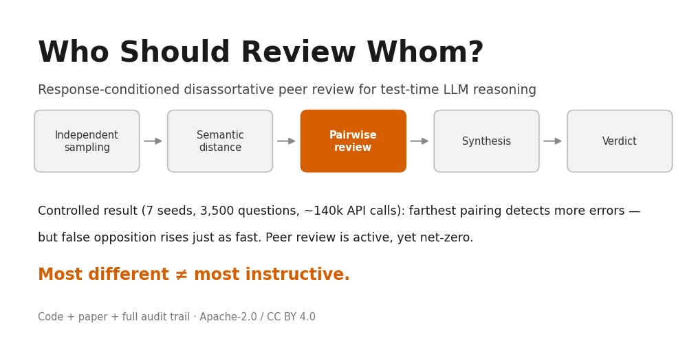
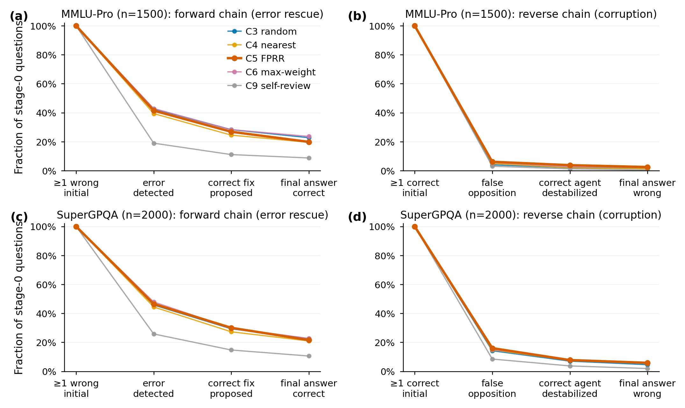
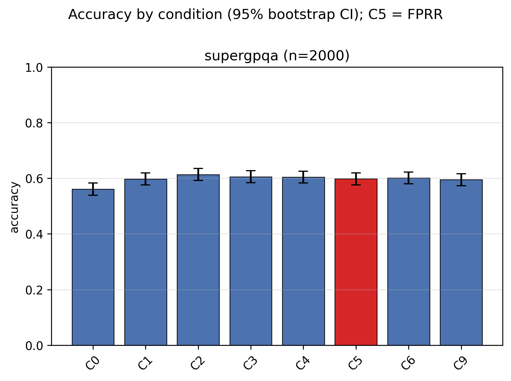
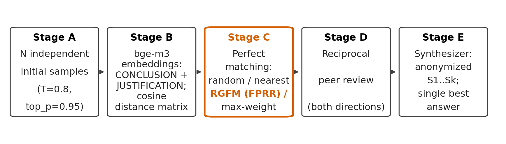

# Who Should Review Whom?

**Response-conditioned disassortative peer review for test-time LLM reasoning — a controlled study with a complete audit trail.**



[](LICENSE)
[](LICENSE)
[](requirements.txt)

> When several homogeneous LLM agents independently solve the same problem, does pairing the **most semantically dissimilar** solutions for reciprocal peer review expose correlated errors better than random pairing, similarity-based pairing, or majority voting?
>
> **Controlled answer: no.** Farthest pairing reliably detects *more* errors — and destroys just as many correct answers. The bottleneck is not *who reviews whom*, but whether the system can tell corrective disagreement from false opposition.

---

## Headline results

One frozen model (`deepseek-flash`, thinking disabled, T=0.8), N=4 agents, identical prompts/decoding. All pairing conditions operate on the **same cached initial answers** per question, so topology is the only thing that differs. MMLU-Pro: 500 questions × 3 seeds. SuperGPQA: 500 questions × 4 seeds.

| Condition | Pairing | Review | MMLU-Pro (n=1500) | SuperGPQA (n=2000) |
|---|---|---|---:|---:|
| C0 Single | — | — | 82.9 | 56.1 |
| C1 Majority vote | — | — | 84.5 | 59.8 |
| C2 Ensemble + synthesizer | — | no | 83.7 | **61.4** |
| C3 Random pair | random | reciprocal | 84.5 | 60.6 |
| C4 Nearest pair | min distance | reciprocal | 84.5 | 60.5 |
| **C5 FPRR (ours)** | **greedy max distance** | reciprocal | 83.9 | 59.9 |
| C6 Max-weight matching | global max | reciprocal | 84.5 | 60.2 |
| C9 Self-review (compute-matched) | self | self | 83.9 | 59.5 |

FPRR vs. random pairing: **−0.5pp** (MMLU-Pro), **−0.7pp** (SuperGPQA); all Holm-corrected p ≥ 0.92, paired-bootstrap CIs all cross 0. On SuperGPQA, skipping review entirely and handing the candidates straight to the synthesizer (C2) **significantly beats every review condition** (C2−C5 = +1.5pp, 95% CI [−2.6, −0.4], p = 0.010): peer review is a net cost there.

## Why — the mechanism in one figure

Semantic distance works exactly as hypothesized at the *detection* stage, and that is precisely where its usefulness ends.



- **Exposure ↑, resolution flat.** Error-detection rate rises monotonically with pair distance (lowest decile 0.00–0.11 → highest 0.30–0.44; logistic β = +12.2 / +7.5, p < 0.0001). The effect does **not** propagate to correct repair or adoption on MMLU-Pro (p = 0.20 / 0.84).
- **The reverse funnel rises in lockstep.** False opposition — a reviewer attacking a *correct* partner answer — and destabilization of valid alternatives also grow with distance. Net transitions: MMLU-Pro 27 rescued vs. 23 corrupted (BTR 0.54); SuperGPQA 49 vs. 79 (BTR 0.38). Review is **active but net-zero**.
- **Novel correct answers exist but never arrive.** Reviewers occasionally generate correct answers absent from all four initial responses (0–4% of all-wrong questions) — refuting the claim that "all information is already in the candidate set" — but end-to-end delivery is ≤ 1.5%.
- **Not outlier amplification.** Max-distance edges are not disproportionately wrong; the real mechanism is that semantic dissimilarity makes reviewers misread *different-but-valid* reasoning as *wrong*.
- **Exploratory signal.** Replacing cosine distance with NLI-contradiction probability for pairing (D4, single-seed, n=200) beats majority voting by +5.0pp on SuperGPQA; D4−D2 = +3.0pp (CI [+0.5, +6.0], p = 0.077). Epistemic opposition looks like a better routing signal than textual difference — fragile, not preregistered, needs replication.



## What is in this repository

```
run_experiment.py        # main pipeline driver (stages A–E)
test_pipeline.py         # 138 offline checks with mock model — no API key needed
src/
  client.py              # async chat client + Ollama bge-m3 embedder (+ offline mocks)
  config.py              # every frozen decision: model, decoding, distances, conditions
  matching.py            # RGFM (greedy farthest), random, nearest, max-weight matching
  nli.py                 # roberta-large-mnli contradiction scoring (D4 ablation)
  analysis.py / evaluate.py / parsing.py / datasets.py
scripts/
  analyze_full.py        # pooled multi-seed analysis: paired bootstrap, McNemar, Holm,
                         # funnel regressions, delivery audit, failure modes
  redraw_figures.py      # F1–F8 publication figures (Okabe-Ito style, scripts/pubstyle.py)
paper/
  main_en.tex            # English manuscript (SCI format)
  main_zh.tex            # 中文论文（SCI 格式）
  main.tex               # original working draft (frozen at tag fprr-paper-v1.0)
figures/                 # F1–F8 + banner (PNG 300dpi; PDF vectors where applicable)
results/                 # per-run JSON/MD + pooled full_analysis_*.json (audit trail)
preregistration.md       # frozen hypotheses/prompts/statistics + all amendments
docs/
  related_work.md        # systematic literature review + novelty matrix
  credit_assignment_design.md  # follow-up study, design frozen, not yet run
  open_data_guide.md     # how to archive the 1.1 GB raw dataset on Zenodo
```

Pipeline architecture:



## Quick start

```bash
pip install -r requirements.txt

# 1. Offline smoke test — 138 checks, mock model, zero API cost:
python test_pipeline.py

# 2. Real run — needs a chat API key and a local Ollama with bge-m3:
export DEEPSEEK_API_KEY=<your-key>        # or set FPRR_KEY_FILE to a dotenv file
ollama pull bge-m3
python run_experiment.py --benchmark mmlu_pro --n 100 --seed 0

# 3. Pooled analysis over finished runs:
python scripts/analyze_full.py --benchmark mmlu_pro
```

Full reproduction notes (exact prompts, cached-response protocol, seed list) are in `preregistration.md` and `paper/main_en.tex` §4.

## Data availability

The complete raw record — ~140k API calls: initial answers, bge-m3 embeddings, full distance matrices, pair assignments, reviews, syntheses, token counts, latency, for every question × seed × condition — is ~1.1 GB (gitignored). We archive it on Zenodo so that **every number in the paper can be recomputed, and the cached initial-answer sets can be reused as a zero-API-cost substrate** for new routing/repair methods.

> Dataset DOI: *[to be minted — see `docs/open_data_guide.md`]*

Analysis summary tables (`results/full_analysis_*.json`) are included in this repository.

## Open problems — we explicitly welcome replications and extensions

This study ended at **budget exhaustion, not closure** (`deepseek` balance: ¥0.43). The frozen but unrun items are preregistered (Amendment 8) and are good first projects on top of our cached data:

1. **N ∈ {2, 6, 8} agent-count ablation** — does the net-zero result survive scale?
2. **Replicate the D4 signal** — NLI-contradiction pairing on MMLU-Pro and with more seeds; if it holds, "route on epistemic opposition, not textual distance" becomes a positive claim.
3. **Epistemic credit assignment under disagreement** — our follow-up study: manipulate what the verifier sees (blind / one-sided / both-visible) with candidates, crux, model and budget fixed. Design frozen with falsification criteria in `docs/credit_assignment_design.md`; preregistered stop rule if blindness does not cut the false-opposition pathway.
4. **Other models / benchmarks** — single-model, two-benchmark scope is the main external-validity limit; the pipeline is model-agnostic.
5. **Quality-gated matching** — pair on `distance × quality` instead of distance alone (variant preregistered, never run).

The analysis tooling (paired bootstrap, McNemar + Holm, three-stage funnel regressions, novel-correct delivery audit, BTR) is generic and reusable for any multi-agent inference experiment.

## Citation

If you use the code, data, figures, or manuscript, please cite (see `CITATION.cff`; GitHub shows a "Cite this repository" button):

```bibtex
@misc{fprr2026,
  title  = {Who Should Review Whom? Response-Conditioned Disassortative
            Peer Review for Test-Time LLM Reasoning},
  author = {Li, Rui and Sun, Chenglong and Zheng, Xueyan and Liu, Dan},
  year   = {2026},
  month  = sep,
  note   = {Gi (Beijing) Tech Design Ltd. Manuscript and reproduction package,
            \url{https://github.com/lratusa/how_agents_talk_matters}},
  howpublished = {\url{https://github.com/lratusa/how_agents_talk_matters}}
}
```

## Authors

Rui Li, Chenglong Sun, Xueyan Zheng, Dan Liu — [Gi (Beijing) Tech Design Ltd.](https://gitechdesign.com) (际和（北京）科技有限责任公司). The research pages are published on the company's homepage.

## License

- **Code** (all `.py`): [Apache License 2.0](LICENSE) — includes an express patent grant.
- **Paper, figures, documentation** (`paper/`, `figures/`, `docs/`): [CC BY 4.0](https://creativecommons.org/licenses/by/4.0/) — free to share and adapt with attribution.

Both licenses require attribution; neither restricts commercial use or derivative research.

## Integrity statement

Every reported number comes from a real API run recorded in `results/` and the archived dataset; nothing is fabricated or interpolated. Experiments that were designed but not run (N-ablation, pairing-seed variance, MMLU-Pro D4) are labeled **not run** in the manuscript. The exploratory D4 result is labeled exploratory. The negative headline result is the headline result.
